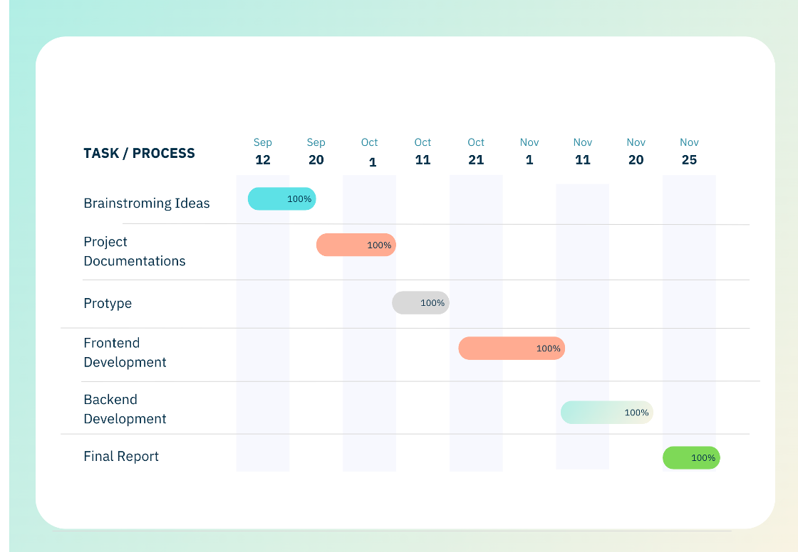

# CineScope Project Report

## Team Members
- [Jeet Patel (200479073)](https://github.com/Jeet0410) 
- [Jay Patel (200468891)](https://github.com/JAY0103) 
- [Jenil Chaklasiya (200477517)](https://github.com/Chaklasiya10)

## Table of Contents
1. [Introduction](#1-introduction)
2. [Design Problem](#2-design-problem)
   - 2.1 [Problem Definition](#21-problem-definition)
   - 2.2 [Project Charter](#22-project-charter)
3. [Solution](#solution)
   - 3.1 [Solution 1](#31-solution-1)
   - 3.2 [Solution 2](#32-solution-2)
   - 3.3 [Final Solution](#33-final-solution)
4. [Team Work](#4-team-work)
5. [Project Management](#5-project-management)
6. [Conclusion and Future Work](#6-conclusion-and-future-work)
7. [Appendix](#run-app-on-your-localhost)

## List of Figures

1. [Figure 1: Gantt Chart](#5-project-management)

## List of Tables

1. [Table 1: Week 1 Meeting](#4-team-work)
2. [Table 2: Week 2 Meeting](#4-team-work)
3. [Table 3: Week 4 Meeting](#4-team-work)
4. [Table 4: Week 6 Meeting](#4-team-work)
5. [Table 5: Week 7 Meeting](#4-team-work)
6. [Table 6: Week 9 Meeting](#4-team-work)
7. [Table 7: Week 11 Meeting](#4-team-work)

## 1. Introduction
CineScope is a web-based media information database designed to provide users with comprehensive details on movies, TV shows, and actors. The platform enhances the user experience through features such as search, review, and rating capabilities, with a unique focus on supporting independent filmmakers. By using MVC architecture, CineScope creates a seamless interaction environment, allowing users to engage with both mainstream and indie content.

## 2. Design Problem

### 2.1 Problem Definition
- The project addresses the need for a media platform where users can search, review, and rate various media while supporting indie filmmakers. CineScope aims to fill a gap in the market by providing an interactive, community-driven experience that caters to both mainstream audiences and indie creators.
- Business Case: [Business Case](./Docs/Business%20Case.pdf)

### 2.2 Project Charter
- The project objectives include developing a functional media information database with an MVC structure, a user-friendly interface, and secure API integration for real-time media updates. We have included privacy and security measures in compliance with GDPR standards to protect user data.
- Project Constraint and Requirements : [Project Charter](./Docs/Project%20Charter.pdf)

## 3. Solution

### 3.1 Solution 1
- This initial approach involved building a media information database with core features like browsing and rating media content. The API integration provided real-time updates, while a simple UI allowed basic user interaction. However, limitations such as the lack of indie support, minimal user engagement features, and insufficient privacy measures led to exploring an improved solution.
- Iterative Engineering Design Process: [Design 1](./Docs/iterative_engineering_design_process.pdf)

### 3.2 Solution 2
- The second iteration introduced support for independent filmmakers, enhanced interactivity (e.g., user profiles, reviews, favorites tracking), and performance optimization through load balancing. Privacy and regulatory compliance were achieved with secure login and GDPR-aligned data handling. Though Solution 2 increased project costs, an MVP approach helped manage expenses.
- Iterative Engineering Design Process: [Design 2](./Docs/iterative_engineering_design_process.pdf)

### 3.3 Final Solution

- CineScope is a comprehensive media platform designed for both movie enthusiasts and independent creators, offering dynamic content discovery and promotion. It features a creator dashboard for managing shows and movies, interactive user profiles, robust review capabilities, and a seamless blend of global and local content, including dedicated sections for top-rated genres and regional events. 
- Powered by the TMDB API, CineScope delivers real-time updates on trending movies, supported by a scalable Node.js and MongoDB backend. Its responsive, user-friendly design ensures accessibility across devices, while its foundation supports future enhancements like creator analytics and premium features, positioning CineScope as a unique bridge between mainstream entertainment and independent creativity.
- Final Solution: [Final Design](./Docs/iterative_engineering_design_process.pdf)

## 4. Team Work
* [Meeting 1:](./Docs/week%201/)
    * **Date:** September 12, 2024 [Week 1]
    * **Agenda**: Brainstorming and Research
    * [Meeting Agenda](./Docs/week%201/Week1_Meeting_Agenda.pdf)
    * [Meeting Minutes](./Docs/week%201/Week1_Meeting_Minutes.pdf)
    * [Project Status Report](./Docs/week%201/Week1_Project_Status_Report.pdf)

        | Team Member | Previous Task | Completion State  | Next Task|
        |----------|----------|----------|----------|
        | Jeet Patel   | N/A     | N/A     | Collaborate with one other.    |
        | Jay Patel   | N/A     | N/A     | Collaborate with one other.    |
        | Jenil Chaklasiya| N/A     | N/A     | Collaborate with one other.     |

* [Meeting 2:](./Docs/week%202/)
    * **Date:** September 20, 2024 [Week 2]
    * **Agenda**: Business Case and Documentation
    - [Meeting Agenda](./Docs/week%202/Week2_Meeting_Agenda.pdf)
    - [Meeting Minutes](./Docs/week%202/Week2_Meeting_Minutes.pdf)
    - [Project Status Report](./Docs/week%202/Week2_Project_Status_Report.pdf)

        | Team Member | Previous Task | Completion State  | Next Task|
        |----------|----------|----------|----------|
        | Jeet Patel   | Brainstorming     | 100%     | Business Case    |
        | Jay Patel   | Brainstorming     | 100%    | Project Charter    |
        | Jenil Chaklasiya| Brainstorming     | 100%    | Cost-Benefit Analysis     |

* [Meeting 3:](./Docs/week%204/)
    * **Date:** October 03, 2024 [Week 4]
    * **Agenda**: Design Constraint and Prototyping
    - [Meeting Agenda](./Docs/week%204/Week4_Meeting_Agenda.pdf)
    - [Meeting Minutes](./Docs/week%204/Week4_Meeting_Minutes.pdf)
    - [Project Status Report](./Docs/week%204/Week4_Project_Status_Report.pdf)

        | Team Member | Previous Task | Completion State  | Next Task|
        |----------|----------|----------|----------|
        | Jeet Patel   | Business Case   | 100%   | Low-Fidelity Prototyping  |
        | Jay Patel   |Project Charter    | 100%      | Low-Fidelity Prototyping |
        | Jenil Chaklasiya|Cost-Benefit Analysis  | 100%      | Low-Fidelity Prototyping |

* [Meeting 4:](./Docs/week%206/)
    * **Date:** October 14, 2024 [Week 6]
    * **Agenda**: Front-End Development
    - [Meeting Agenda](./Docs/week%206/Week6_Meeting_Agenda.pdf)
    - [Meeting Minutes](./Docs/week%206/Week6_Meeting_Minutes.pdf)
    - [Project Status Report](./Docs/week%206/Week6_Project_Status_Report.pdf)

        | Team Member | Previous Task | Completion State  | Next Task|
        |----------|----------|----------|----------|
        | Jeet Patel   | Low-Fidelity Prototyping   | 100%   | Front-End Development  |
        | Jay Patel   |Low-Fidelity Prototyping    | 100%      | Front-End Development  |
        | Jenil Chaklasiya|Low-Fidelity Prototyping  | 100%      | Front-End Development  |

* [Meeting 5:](./docs/week%207/)
    * **Date:** October 24, 2024 [Week 7]
    * **Agenda**: API Integration
    - [Meeting Agenda](./Docs/week%207/Week7_Meeting_Agenda.pdf)
    - [Meeting Minutes](./Docs/week%207/Week7_Meeting_Minutes.pdf)

        | Team Member | Previous Task | Completion State  | Next Task|
        |----------|----------|----------|----------|
        | Jeet Patel   | Front-End Development   | 80%   | API Integration  |
        | Jay Patel   |Front-End Development    | 70%     | Front-End Development continue  |
        | Jenil Chaklasiya|Front-End Development  | 70%      | Front-End Development  |

* [Meeting 6:](./Docs/week%209/)
    * **Date:** November 04, 2024 [Week 9]
    * **Agenda**: Back-End Development
    - [Meeting Agenda](./Docs/week%209/Week9_Meeting_Agenda.pdf)
    - [Meeting Minutes](./Docs/week%209/Week9_Meeting_Minutes.pdf)
    - [Project Status Report](./Docs/week%209/Week9_Project_Status_Report.pdf)

        | Team Member | Previous Task | Completion State  | Next Task|
        |----------|----------|----------|----------|
        | Jeet Patel   | API Integration   | 100%   | Back-End DB Integration |
        | Jay Patel   |Front-End Development    | 90%    | Front-End Development dashboard  |
        | Jenil Chaklasiya|Front-End Development  | 85%      | Back-End Development  |

* [Meeting 7:](./Docs/week%2011//)
    * **Date:** November 20, 2024 [Week 11]
    * **Agenda**: Last Meeting 
    - [Meeting Agenda](./Docs/week%2011/Week11_Meeting_Agenda.pdf)
    - [Meeting Minutes](./Docs/week%2011/Week11_Meeting_Minutes.pdf)
    - [Project Status Report](./Docs/week%2011/Week11_Project_Status_Report.pdf)

        | Team Member | Previous Task | Completion State  | Next Task|
        |----------|----------|----------|----------|
        | Jeet Patel   | Back-End DB Integration   | 100%   | Back-End Indie Creator Access  |
        | Jay Patel   |Front-End Development    | 100%    | Documentation  |
        | Jenil Chaklasiya|Back-End Development  | 95%      | Documentation Finalisation  |

## 5. Project Management
- A milestone-based schedule, tracked via GitHub and supported by weekly updates, was implemented to ensure timely completion. The schedule accounted for design, development, and testing phases, with a Gantt chart visualizing progress and identifying critical tasks.

- Milestone Based Schedule: [Milestone Based Schedule](./Docs/Milestone_Based_Schedule.pdf)

- Cinescope Gantt Chart: 

## 6. Conclusion and Future Work

### Conclusion
- CineScope has established itself as a dynamic platform that seamlessly integrates movie discovery with content creation. By providing personalized experiences for users and empowering creators with tools to showcase their work, the platform bridges the gap between mainstream and independent entertainment. Its responsive design, robust backend, and real-time updates ensure a user-friendly and engaging experience. 
- The successful implementation of features like trending movie carousels, local shows, creator dashboards, and review systems highlights the platform's adaptability and relevance in the competitive entertainment space. CineScope not only meets the immediate needs of its diverse audience but also lays the groundwork for continuous growth and improvement.

### Future Work
- **Add and Delete Movies/Shows:** Creators will have a dedicated interface to easily add, edit, or remove their content from the platform.
- **Like and Dislike on Reviews:** Users will be able to like or dislike reviews, highlighting the most helpful feedback.
- **Follow Functionality:** Users can follow specific movies or shows to receive updates about new reviews, events, or creator announcements.
- **Advanced Sorting and Filtering:** Provide users with the ability to sort and filter content by genres, ratings, release dates, and popularity for personalized browsing.
- **Favorites and Watchlist:** Introduce options for users to save movies or shows into a personal watchlist or favorites section for quick access
- **Event Calendar Integration:** Create a calendar view for browsing local shows and booking tickets directly through the platform.
- **Monetization Options:** Introduce premium subscriptions for exclusive content or features like analytics dashboard, and advertising opportunities for creators to promote their shows.

## Run app on your localhost:

`Change directory to backend`

        cd code/backend

`[IF REQUIRED] Install any missing dependencies`

        npm install "missing-dependencies"

`[OPTIONAL] If you wish to enjoy local shows functionality, seed the DB with initial data`

        node seedLocalShows.js

`Run on your localhost`

        npm start

`Wait for the prompt`

        Server is running on port 3000
        Connected to MongoDB

### Enjoy CineScope !!

[## 7. References
Follow IEEE reference style. Include only sources cited in the text.]:#
